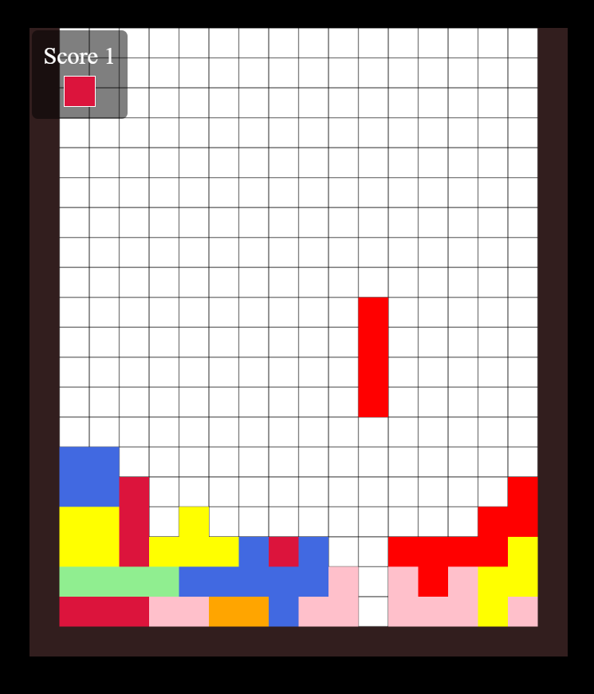

# Teris Game

A simple Tetris-like game built with HTML, CSS, and JavaScript.

This project is a browser-based implementation of the classic Tetris game, designed for learning and fun. It features a clean UI, responsive controls, and a preview of the next shape. The code is organized for easy understanding and modification.

## Features
- Playable Tetris game in the browser
- Score tracking
- Next shape preview
- Responsive design

- Customizable grid size (adapts to your window size)
- Keyboard controls for smooth gameplay
- Simple, readable codebase for easy learning

## How to Run
1. Clone or download this repository.
2. Open `index.html` in your web browser.

No build steps or dependencies are required. Just open the HTML file and play!

## Controls
- **Left Arrow / A**: Move shape left
- **Right Arrow / D**: Move shape right
- **Down Arrow / S**: Move shape down faster
- **Spacebar**: Rotate shape

You can use either the arrow keys or WASD for movement. The game is designed to be intuitive and responsive.

## Files
- `index.html` — Main HTML file
- `style.css` — Game styling
- `script.js` — Game logic

### File Structure

```
Teris-Game/
├── index.html      # Main HTML file
├── style.css       # CSS styles for layout and game visuals
├── script.js       # JavaScript game logic
└── README.md       # Project documentation
```

## Screenshot


---

## Gameplay Details

- The game grid automatically resizes based on your browser window.
- Each shape is randomly selected and colored.
- The next shape is previewed in the sidebar.
- Score increases by 1 for each completed row.
- The game ends when new shapes can no longer enter the grid.

## Customization

- To change the speed, adjust the `fps` variable in `script.js`.
- You can add or modify shapes in the `shapes` array in `script.js`.
- Colors can be changed in the `colors` array.

## Troubleshooting

- If the game does not display correctly, try resizing your browser window or refreshing the page.
- Make sure JavaScript is enabled in your browser.

## Credits

Created by Mustak24. Inspired by the classic Tetris game.

---

Created for fun and learning purposes. Contributions and suggestions are welcome!
